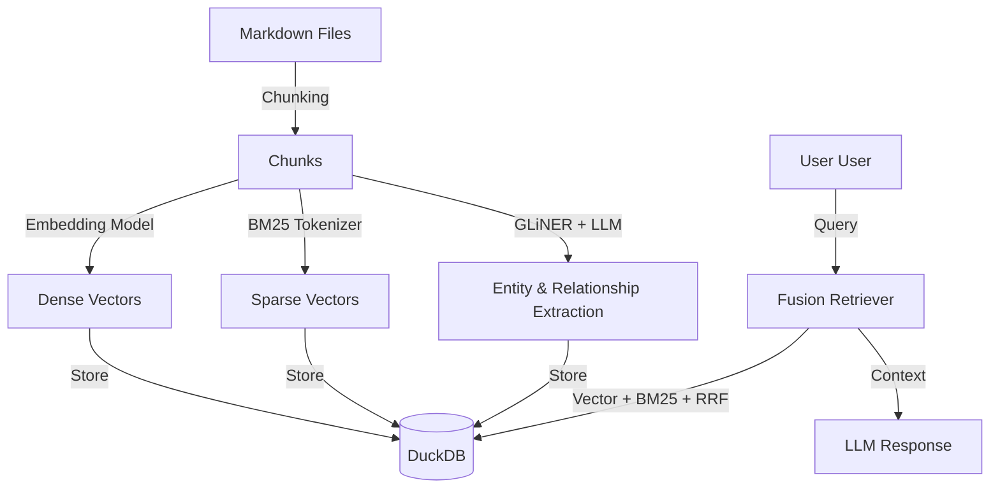

# GraphRAG Llama Index

A high-performance, privacy-first **GraphRAG (Retrieval Augmented Generation)** implementation designed to run locally. It leverages **DuckDB** for unified storage, **BM25 + Vector Fusion** for robust keyword retrieval, and a streamlined entity-relationship extraction pipeline.

## Project Description

GraphRAG Llama Index provides a complete solution for transforming raw text collections into a queryable knowledge graph. Unlike cloud-only solutions, it is designed from the ground up for:

- **Local Execution**: Run entirely offline using Docker-hosted models (Ollama, Docker Model Runner).
- **Cost Efficiency**: No per-token API fees when using local models.
- **Privacy**: Your data never leaves your infrastructure when using local models.
- **Agent Integration**: Native support for the **Model Context Protocol (MCP)** and **TSON (Typed Structured Object Notation)** output, allowing AI agents (like Gemini and Claude CLI) to query your knowledge base with maximum token efficiency.

---

## Features & Architecture

For a deep dive into the system concepts and architecture, please refer to the [What is GraphRAG?](./docs/what-is-graphrag.md).

### Key Features

- **🦆 Unified Storage**: All data including documents, chunks, entities, relationships, vectors, and stats, resides in a single, portable `DuckDB` file.
- **🔍 Hybrid Method of Popular Retrieval Design**: Combines **BM25** (keyword relevance) with **Vector Search** (semantic similarity) using **Reciprocal Rank Fusion (RRF)** for superior recall.
- **🛡️ Robust Indexing Pipeline**:
  - **Auto-Resume**: Tracks state at the document level (`chunked` -> `embedded` -> `extracted`). If interrupted, it resumes exactly where it left off.
  - **Pruning & Garbage Filtering**: A multi-stage design to ensure high-quality data:
    - **Stage 1 (Pre-extraction)**: Filters noise based on character repetition, Shannon entropy, and malformed text.
    - **Stage 2 (Post-extraction)**: Prunes "stranded entities" (those with no relationships) and chunks with low entity density. (Pretty Risky)
    - **Stage 3 (Semantic)**: Uses embedding outlier detection and optional LLM-based quality scoring to remove low-information content.
- **🔌 MCP Server**: Exposes standard tools (`search`, `explore_entity_graph`, `get_corpus_stats`) for seamless integration with AI assistants.
- **💎 TSON Support**: Optimized response format that reduces token overhead by up to 30% compared to standard JSON, specifically designed for high-density graph data.

### High-Level Architecture



---

## Example Use Case

**Scenario: Analying Financial Market Shifts**

You have a collection of financial news reports (e.g., "Nvidia acquiring Groq", "Market trends in 2025").

1.  **Ingest**: Drop markdown files into any desired diretory, or if you have an existing directory, mount that directory to `./input` in `docker-compose.yml`.
2.  **Index**: The system builds a graph connecting entities like "Nvidia", "Groq", "Jensen Huang" with relationships like `ACQUIRED`, `COMPETES_WITH`.
3.  **Query**:
    - _Fact-based_: "How much did Nvidia pay?" -> Hits precise text chunks via BM25.
    - _Thematic_: "What is the impact on AI chip competition?" -> Uses Vector search + Entity Graph traversal to synthesize a broader answer.

---

## Configuration: Local LLM vs. OpenRouter

This system is designed for flexibility. You can swap the "brain" of the operation without changing code.

### Option A: Fully Local (Privacy & Cost)

Best for: Sensitive data, offline usage, free experimentation.

- **Embeddings**: `ai/qwen3-embedding:latest` or `ai/granite-embedding-multilingual:latest`
- **LLM**: `ai/ministral3:latest` or `ai/granite-4.0-micro:latest`
- **Inference** via Docker Model Runner, or if you prefer Ollama, you can configure the `.env` and the `graphrag_config.py` to use Ollama instead.

### Option B: Cloud/OpenRouter (Quality & Speed)

Best for: Complex reasoning, higher quality extraction, production use.

- **LLM**: Connect to OpenAI, Anthropic, or DeepSeek via **OpenRouter**.

**Switching Providers in `.env`**:

| Setting                 | Local (Docker)                         | OpenRouter                     |
| :---------------------- | :------------------------------------- | :----------------------------- |
| `RELATIONSHIP_PROVIDER` | `openai` (configured for local)        | `openrouter`                   |
| `LLM_URL`               | `http://host.docker.internal:12434/v1` | `https://openrouter.ai/api/v1` |
| `LLM_MODEL`             | `llama3.3:8b`                          | `deepseek/deepseek-chat`       |
| `LLM_API_KEY`           | `not-needed`                           | `your-sk-key...`               |

_(See `.env.example` for exact configurations)_

---

## 🛠️ Setup Guide

### Prerequisites

- **Docker Desktop** (Installed & Running)
- **Python 3.10+** (Optional, for local debugging)

### 1. Initialize Project

```bash
# Clone repository
git clone <repo-url>
cd graphrag-local

# Setup environment variables
cp .env.example .env
# Edit .env to choose your model provider (Local or OpenRouter)
```

### 2. Add Documents

Configure the system to read your documents by mounting your local directory to `/app/input` in the `docker-compose.yml` file:

```yaml
services:
  graphrag:
    volumes:
      - /path/to/your/documents:/app/input
```

Alternatively, you can copy markdown `.md` or text `.txt` files directly into the local `./input` directory.

### 3. Build & Run

We use Docker Compose to orchestrate the environment.

```bash
# Build the images
docker compose build

# Pro-Tip: docker compose build vs manual build
# Running 'docker compose build' is equivalent to 'docker build -t graphrag-llamaindex .',
# but it automatically uses the settings (context, image name, args) defined in your
# docker-compose.yml, ensuring consistency across all services (graphrag, mcp, etc.).

# Run the Indexer (Processes documents strings -> graph)
docker compose up graphrag

# Optional: Run with Pruning
# The --prune flag removes low-quality chunks and stranded entities after extraction.
# ⚠️ DISCLAIMER: Run WITHOUT --prune first!
# Verify your data in the Database Viewer before applying pruning to avoid over-deletion.
docker compose run --rm graphrag python indexer.py --prune
```

### 4. Interacting with the Graph

There are several ways to interact with and visualize your data:

#### A. Database Viewer (Interactive Dashboard)

Visualize your knowledge graph, browse chunks, and inspect entity relationships through a web-based dashboard.

```bash
# 1. Export database state to viewer format
docker compose run --rm graphrag python output/database_viewer/exporter.py

# 2. Open the viewer in your browser
# Open e:/ai-workspace/projects/graphRAG-LlamaIndex/output/database_viewer/index.html
```

#### B. Direct CLI Queries (Human Interface)

Use the `graphrag` service to perform complex, multi-stage RAG queries directly from your terminal. This invokes the full `query_engine.py` for synthesized answers.

```bash
# General search
docker compose run --rm graphrag python query_engine.py "How does fusion retrieval work?"

# Specific Search Type (e.g., local search for entities)
docker compose run --rm graphrag python query_engine.py "Nvidia" --type find_connections
```

#### C. MCP Server (AI Agent Integration)

The `mcp` service exposes the graph tools to external AI agents (like **Claude Desktop** or **Gemini CLI**) via the **Model Context Protocol**.

##### Local Desktop Integration

To integrate with Gemini CLI or Claude Desktop, add the following configuration to your MCP `settings.json`:

**For Gemini CLI**: `~/.gemini/settings.json`  
**For Claude Desktop**: `~/Library/Application Support/Claude/claude_desktop_config.json` (macOS) or `%APPDATA%\Claude\claude_desktop_config.json` (Windows)

```json
{
  "mcpServers": {
    "graphrag": {
      "command": "docker",
      "args": [
        "run",
        "-i",
        "--rm",
        "-v",
        "/path/to/your/graphRAG-LlamaIndex:/app",
        "-v",
        "graphrag_node_modules:/app/node_modules",
        "-v",
        "/path/to/your/graphRAG-LlamaIndex/.DuckDB:/app/.DuckDB",
        "-v",
        "/path/to/your/graphRAG-LlamaIndex/output:/app/output",
        "--add-host=host.docker.internal:host-gateway",
        "--env-file",
        "/path/to/your/graphRAG-LlamaIndex/.env",
        "-e",
        "NODE_NO_WARNINGS=1",
        "graphrag-llamaindex",
        "npx",
        "tsx",
        "mcp_server.ts"
      ]
    }
  }
}
```

**Important Path Adjustments**:

- Replace `/path/to/your/graphRAG-LlamaIndex` with your actual project path
- On Windows, use WSL paths (`/mnt/c/...` for `C:\...`)
- On macOS/Linux, use absolute paths (e.g., `/Users/yourname/projects/graphRAG-LlamaIndex`)

**Verify Integration**:
After adding the configuration, restart your AI client. You should see three new tools available:

- `search(query, mode, topK)` - Main retrieval interface
- `explore_entity_graph(entityName, depth)` - Graph traversal
- `get_corpus_stats()` - Database health check

##### ⚠️ Web Service Limitation

**This MCP server is designed for local desktop use only.** It cannot be used with web-based AI services (like ChatGPT, Claude Web, or Gemini Web) because:

1. **No Public Endpoint**: The MCP server runs on your local machine via Docker. Web services cannot reach `localhost` or Docker containers on your computer.
2. **Security Model**: MCP uses `stdio` (standard input/output) for communication, which requires direct process execution—not possible over HTTP.
3. **File System Access**: The server needs direct access to your local `.DuckDB` database and `output/` directory.

**Alternative for Web Services**:
If you need to expose your GraphRAG index to web-based AI tools, you would need to:

1. Deploy a REST API wrapper (e.g., using FastAPI) around `query_engine.py`
2. Host it on a cloud server (AWS, DigitalOcean, etc.)
3. Secure it with API keys and HTTPS
4. Configure the web AI service to call your API endpoint

This is beyond the scope of this local-first implementation.

### 5. Utilities & Stats (MCP Toolset)

You can also call the MCP tools directly via the CLI using the `mcp.py` helper. This is faster than a full RAG query and is used for checking corpus health or exploring raw graph data.

```bash
# Get database statistics (counts for documents, entities, etc.)
docker compose run --rm graphrag python mcp.py "get_corpus_stats()"

# Test a search tool call directly
docker compose run --rm graphrag python mcp.py "search('Nvidia')"
```
