# Garbage Filtering Explained

**Target Audience**: [Mixed] - Beginners should read the "Why" section; Advanced users can jump to "Tuning Guide"

**TL;DR**: Garbage filtering removes junk (repetitive text, navigation menus, broken PDFs) before it pollutes your knowledge graph. It's aggressive but necessary—**always run without `--prune` first** and verify your data in the Database Viewer.

---

## The Problem: Why Filtering Matters

### Without Filtering

Imagine indexing a web-scraped PDF. Your input contains:

```
Home | About | Contact | Privacy
=====================================
The future of AI chip manufacturing...
Home | About | Contact | Privacy
=====================================
China's semiconductor dominance...
Home | About | Contact | Privacy
```

**What happens**:

1. The header/footer gets extracted as entities: "Home", "About", "Contact", "Privacy"
2. These meaningless entities get equal weight to real concepts like "semiconductor"
3. LLM wastes tokens extracting relationships between "Home" and "About"
4. Your queries return navigation menus instead of actual content

### With Filtering

The system detects:

- High character repetition (`====` repeated 30+ times)
- Low Shannon entropy (1.2 bits vs healthy 4.5+ bits)
- Excessive whitespace (50% of chunk is spaces/newlines)

**Result**: Header/footer chunks are skipped. Only the meaningful paragraphs get indexed.

---

## How It Works: Multi-Stage Design

```mermaid
graph TD
    A["📄 Raw Document"] --> B["Stage 0: Whitespace Normalization"]
    B --> C["📦 Text Chunks"]

    C --> D{"Stage 1: Preprocessing Filters"}
    D -->|"✅ Pass"| E["Embed & Index"]
    D -->|"❌ Fail"| F1["🗑️ Pruning Log"]

    E --> G{"Stage 2: Graph Filters<br/>(Post-Extraction)"}
    G -->|"✅ Has Entities"| H["💾 Store in DB"]
    G -->|"❌ Stranded"| F2["🗑️ Pruning Log"]

    H --> I{"Stage 3: Semantic Filters<br/>(Optional)"}
    I -->|"✅ High Quality"| J["✅ Final Graph"]
    I -->|"❌ Outlier/Low Quality"| F3["🗑️ Pruning Log"]

    F1 & F2 & F3 --> K["📊 Pruning Evidence Viewer"]

    style D fill:#fff3cd
    style G fill:#cfe2ff
    style I fill:#e2e3e5
    style F1 fill:#f8d7da
    style F2 fill:#f8d7da
    style F3 fill:#f8d7da
```



---

## Stage Breakdown

### Stage 0: Whitespace Normalization [Beginner]

**When**: Before chunking  
**Purpose**: Maximize real content per chunk

**What it does**:

- Collapses 3+ newlines → 2 newlines (preserves paragraphs, removes gaps)
- Collapses 3+ spaces → 1 space (fixes horizontal noise)

**Example**:

```diff
- The market\n\n\n\n\nis volatile.
+ The market\n\nis volatile.
```

---

### Stage 1: Preprocessing Filters [Intermediate]

**When**: Immediately after chunking  
**Purpose**: Catch obvious junk before wasting LLM/embedding resources

#### Filter 1.1: Character Repetition

**Threshold**: `FILTER_REPETITION_THRESHOLD = 0.4` (40%)  
**Logic**: If the most common character appears in >40% of the chunk, reject it

**Example Caught**:

```
========================================
========================================
Table of Contents
========================================
```

(The `=` character appears 80+ times out of 120 total → **Rejected**)

#### Filter 1.2: Shannon Entropy

**Thresholds**:

- Min: `FILTER_MIN_ENTROPY = 3.0` bits
- Max: `FILTER_MAX_ENTROPY = 7.0` bits

**What is Entropy?** A measure of "randomness" or "information density":

- Low entropy (< 3.0): Repetitive patterns (`aaaaaa`, `111111`)
- Healthy entropy (3.0 - 7.0): Natural language
- High entropy (> 7.0): Random garbage (`x7Kg#%9@Lp`)

**Example Caught**:

```
Click here click here click here click here...
```

(Entropy: 2.1 bits → **Rejected**)

#### Filter 1.3: Broken Ligatures

**Threshold**: `FILTER_MALFORMED_THRESHOLD = 0.05` (5% of words)  
**Logic**: Detects PDF extraction errors where ligatures split

**Example Caught**:

```
The  af  liation between the of  cial and the  rm...
```

("affiliation", "official", "firm" are broken → **Rejected**)

#### Filter 1.4: Whitespace Density

**Threshold**: `FILTER_MAX_WHITESPACE_DENSITY = 0.30` (30%)  
**Logic**: If more than 30% of characters are spaces/newlines, reject

---

### Stage 2: Graph-Based Filters [Advanced]

**When**: After entity extraction  
**Purpose**: Remove semantically empty text (no knowledge contribution)

#### Filter 2.1: Stranded Entities

**Logic**: Delete entities that have zero relationships (isolated nodes)

**Why Risky?**:

- Some entities are legitimately mentioned once (e.g., a minor stakeholder)
- Over-pruning can remove valid context

**Mitigation**:

- Always verify in Database Viewer before pruning
- Consider adjusting `FILTER_QUALITY_THRESHOLD` instead of deleting

**Example Caught**:

```
Entities: ["capital risk", "moat", "competitive advantage"]
Relationships: []
```

(All three entities have no connections → **Deleted**)

#### Filter 2.2: Low Entity Density

**Threshold**: `FILTER_MIN_ENTITIES = 0` (DISABLED by default since 2026-01-08)

**Why Disabled?**:

- GLiNER produces 0 entities for 99% of legitimate chunks (headers, summaries)
- Entity count is domain-dependent (tech docs have more than narrative text)
- Creates false positives (deletes good content)

---

### Stage 3: Semantic Filters [Advanced, Optional]

**When**: User runs `--prune` with advanced flags  
**Purpose**: Use embeddings/LLM to catch subtle noise

#### Filter 3.1: Embedding Outlier Detection

**Threshold**: `FILTER_EMBEDDING_OUTLIER_THRESHOLD = 0.50`  
**Logic**: For each document, calculate the "centroid" (average embedding). Chunks with cosine similarity < 0.50 to their own document's centroid are flagged.

**Example Caught**:
In a financial report about "EV battery supply chains", a random chunk about "cookie recipes" (likely OCR error) would score 0.12 similarity → **Rejected**

#### Filter 3.2: LLM Quality Scorer

**Threshold**: `FILTER_QUALITY_THRESHOLD = 0.75`  
**Logic**: Ask the LLM to score chunk quality from 0.0 to 1.0

**Prompt**:

> Evaluate this text for information quality. Score 1.0 for meaningful content, 0.0 for pure garbage (navigation, repetitive formatting). Return only a float.

**Trade-off**: Expensive (requires LLM call per chunk) but high precision

---

## Configuration Guide [Advanced]

### Safe Defaults (Recommended)

```python
# graphrag_config.py
FILTER_REPETITION_THRESHOLD = 0.4    # Catches "======" spam
FILTER_MIN_ENTROPY = 3.0             # Catches "click click click"
FILTER_MALFORMED_THRESHOLD = 0.05    # Catches PDF errors
FILTER_MAX_WHITESPACE_DENSITY = 0.30 # Catches empty chunks
```

### Aggressive Pruning (Use with caution)

```python
# For web-scraped content with lots of boilerplate
FILTER_MIN_ENTROPY = 3.5             # Stricter
FILTER_EMBEDDING_OUTLIER_THRESHOLD = 0.60  # More lenient (keeps more)
```

### Minimal Pruning (For curated academic papers)

```python
# Trust the source, only catch obvious errors
FILTER_REPETITION_THRESHOLD = 0.6    # Very lenient
FILTER_MIN_ENTROPY = 2.0             # Very lenient
# Skip stage 2/3 entirely (no --prune flag)
```

---

## How to Use Safely

### Step 1: Index Without Pruning

```bash
docker compose run --rm graphrag python indexer.py
```

### Step 2: Inspect Results in Database Viewer

```bash
# Export database state
docker compose run --rm graphrag python output/database_viewer/exporter.py

# Open output/database_viewer/index.html in browser
# Look at the "Chunks" tab - do they look clean?
```

### Step 3: (Optional) Review Pruning Evidence

If you want to see what **would** be deleted:

```bash
# Run with --prune to generate logs (doesn't delete yet)
docker compose run --rm graphrag python indexer.py --prune

# Open output/pruning_viewer/index.html
# Check if any false positives (good chunks marked as garbage)
```

### Step 4: Confirm and Prune

Only if you're satisfied:

```bash
# This PERMANENTLY deletes flagged chunks
docker compose run --rm graphrag python indexer.py --reset --prune
```

---

## Common Questions

### Q: "I ran `--prune` and lost 90% of my chunks. Help!"

**A**: This happened because `FILTER_MIN_ENTITIES` was set to 1 (old default). GLiNER rarely extracts entities from headers/summaries, so they all got deleted.

**Fix**:

1. Check `graphrag_config.py` line 187 - it should say `# REMOVED: FILTER_MIN_ENTITIES`
2. Run `--reset` to restore from source files
3. Re-index without `--prune`

### Q: "Can I preview what will be deleted without actually deleting?"

**A**: No direct preview mode, but you can:

1. Make a copy of your `.DuckDB/` folder
2. Run `--prune` on the copy
3. Compare chunk counts before/after

### Q: "What's the performance cost of Stage 3 filters?"

**A**:

- **Embedding Outlier**: ~5% slower indexing (needs to calculate centroids)
- **LLM Quality Scorer**: ~50% slower (requires extra LLM call per chunk)

---

## Visual: Pruning Evidence Viewer

After running with `--prune`, open `output/pruning_viewer/index.html`:

**Features**:

- Dashboard showing total chunks vs. pruned chunks
- Filter by pruning reason (e.g., "Entropy too low")
- Search by chunk ID or text content
- Click any card to see full chunk + metadata

**Use Case**: Verify that deleted content was actually garbage, not valuable context.

---

## Next Steps

- **[Beginner]**: Start with [What is GraphRAG?](./what-is-graphrag.md) for a conceptual overview.
- **[Intermediate]**: Review the [System Overview](./system-overview.md) for a technical breakdown of the architecture.
- **[Advanced]**: See [Performance Tuning](../04-advanced/performance-tuning.md) for concurrency optimizations
