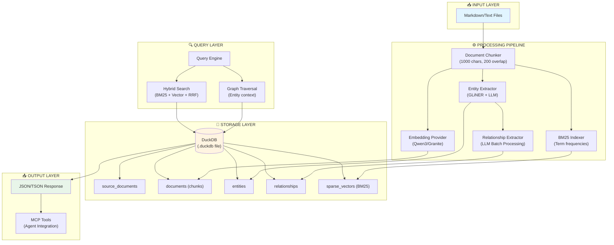
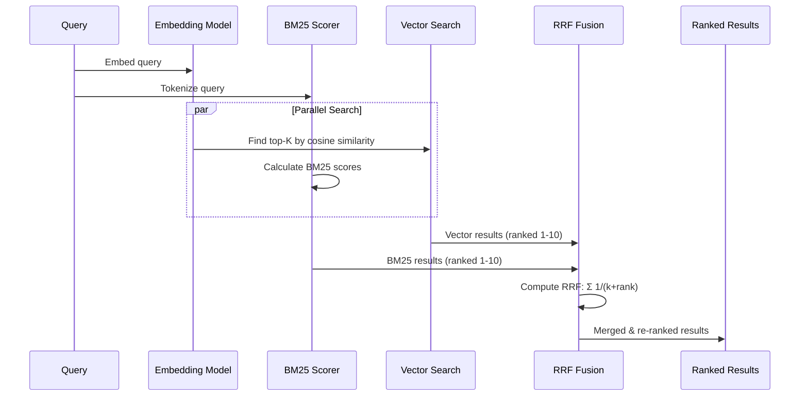
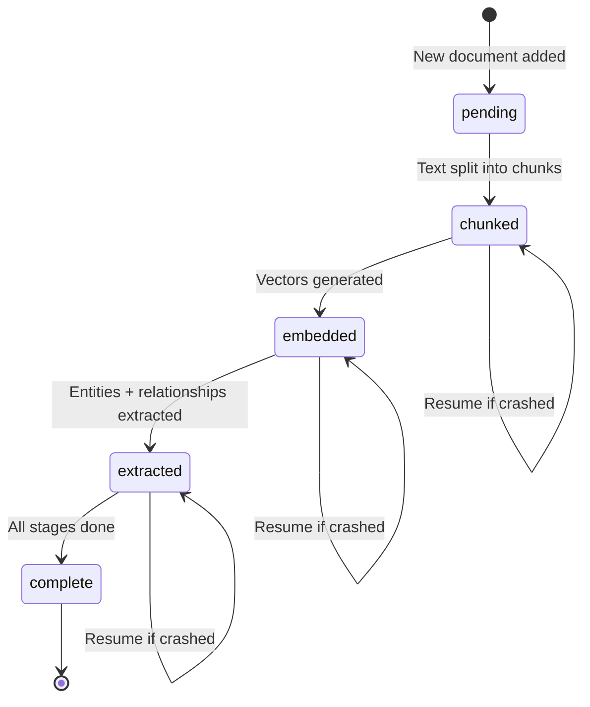
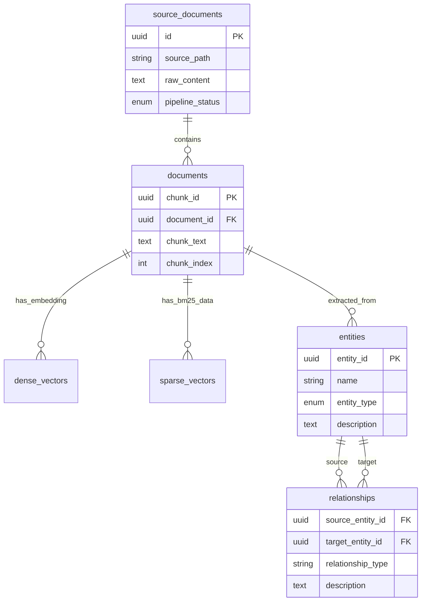

# System Architecture Overview

**Target Audience**: [Intermediate] - Familiar with RAG concepts, new to graph-based systems

**TL;DR**: GraphRAG Llama Index uses a unified DuckDB storage layer, hybrid retrieval (BM25 + Vectors), and an auto-resumable indexing pipeline to transform documents into a queryable knowledge graph.

---

## High-Level Architecture



---

## Why This Design?

### 1. **Unified Storage (DuckDB)**

**Decision**: Use a single DuckDB file instead of separated vector stores + graph databases.

**Rationale**:

- **Simplicity**: One `.duckdb` file contains everything (chunks, vectors, entities, relationships)
- **Portability**: Copy the file → copy the entire knowledge base
- **Performance**: DuckDB's columnar format is optimized for analytical queries (perfect for retrieval)
- **No External Dependencies**: No need for ChromaDB, Pinecone, or Neo4j

**Trade-off**:

- ❌ Not optimized for billion-scale graphs (use Neo4j if you have >10M entities)
- ✅ Perfect for document collections up to ~100k chunks

---

### 2. **Hybrid Retrieval (BM25 + Vector Fusion)**

**Decision**: Combine sparse (BM25) and dense (vector) search instead of using only one.

**Rationale**:

- **BM25 Strengths**: Exact keyword matching, no model required, fast
- **Vector Strengths**: Semantic similarity, handles synonyms, multilingual
- **Reciprocal Rank Fusion (RRF)**: Mathematically proven to outperform either method alone

**How it Works**:



**Configuration** (in `.env`):

- `FUSION_ALPHA=0.5`: Equal weighting (adjust 0-1 to prefer BM25 or vectors)
- `RRF_K=60`: Standard RRF parameter (don't change unless you know what you're doing)

---

### 3. **Auto-Resume Indexing Pipeline**

**Decision**: Track pipeline state at the document level instead of processing all-or-nothing.

**Rationale**:

- Large document collections take hours to index
- Network/model failures shouldn't require starting over
- Users can incrementally add documents without re-processing old ones

**State Machine**:



**How to Use**:

- `indexer.py` checks each document's status in `source_documents.pipeline_status`
- If a document is `chunked`, it skips chunking and proceeds to embedding
- To fully reindex everything: `python indexer.py --reset`

---

## Component Breakdown

### Indexing Pipeline (`indexer.py`)

**Key Classes**:

- `GraphRAGIndexer`: Orchestrates the entire pipeline
- `SemanticChunker`: Splits documents (handles overlap, min length)
- `DockerModelRunnerEmbeddings`: Async parallel embedding generation
- `BM25Indexer`: Tokenization + term frequency calculation
- `LLMClient`: Entity/relationship extraction

**Processing Flow**:

1. Discover `.md` files in `input/`
2. Check `source_documents` table for existing entries
3. **For each document**:
   - Load content → Chunk → Embed → BM25 index → Extract entities → Extract relationships
   - Update `pipeline_status` after each stage
4. **Garbage Filtering** (optional with `--prune`): Remove low-quality chunks

---

### Query Engine (`query_engine.py`)

**Search Modes**:
| Mode | Method | Best For |
|:-----|:-------|:---------|
| `find_connections` | Hybrid + Graph Traversal | Entity-centric questions ("Who is connected to X?") |
| `explore_thematic` | Community Summaries (Leiden) | High-level themes ("What are the main topics in my corpus?") |
| `keyword_search` | Hybrid Only | Fast fact lookup ("Find mentions of 'lithium'") |

** Example Query**:

```python
from query_engine import GraphRAGQueryEngine

engine = GraphRAGQueryEngine()
results = engine.search(
    query="What geopolitical risks does Nvidia face?",
    searchType="find_connections",
    topK=5
)
```

**Response Format** (TSON):

```json
{
  "chunks": [...],
  "entities": [...],
  "relationships": [...],
  "metadata": {"fusionAlpha": 0.5, "totalResults": 5}
}
```

---

### Storage Layer (`duckdb_store.py`)

**Schema** (8 tables):



**Key Methods**:

- `insertDocument()`: Create source document record
- `insertChunks()`: Batch insert text chunks
- `insertDenseVectors()`: Store embeddings
- `vectorSimilaritySearch()`: Brute-force cosine similarity
- `insertEntities()`: Upsert with name-based deduplication
- `getRelationshipsForEntity()`: Graph traversal helper

---

## MCP Integration

The system exposes 3 tools via Model Context Protocol:

1. **`search(query, mode, topK)`**: Main retrieval interface
2. **`explore_entity_graph(entityName, depth)`**: BFS traversal from a starting entity
3. **`get_corpus_stats()`**: Database health check (document/chunk/entity counts)

**How Agents Use It**:

```typescript
// Claude Desktop / Gemini CLI can call:
await use_mcp_tool("graphrag", "search", {
  query: "AI chip supply chains",
  mode: "find_connections",
  topK: 10,
});
```

---

## Configuration Points

**Environment Variables** (`.env`):

- `EMBEDDING_MODEL`: Which embedding model to use
- `EMBEDDING_DIMENSION`: Model output size (critical for schema match)
- `LLM_MODEL`: Which LLM for entity extraction
- `RELATIONSHIP_PROVIDER`: `local` or `openrouter`

**Runtime Config** (`graphrag_config.py`):

- `CHUNK_SIZE`: Default 1000 characters
- `FILTER_MIN_ENTROPY`: Garbage filtering threshold
- `MAX_ENTITIES_PER_CHUNK`: LLM extraction limit

---

## Next Steps

- **[Beginner]**: Go back to [What is GraphRAG?](./what-is-graphrag.md) for a high-level conceptual overview.
- **[Deep Dive]**: Explore [Garbage Filtering](./garbage-filtering-explained.md) to understand how we maintain graph quality.
