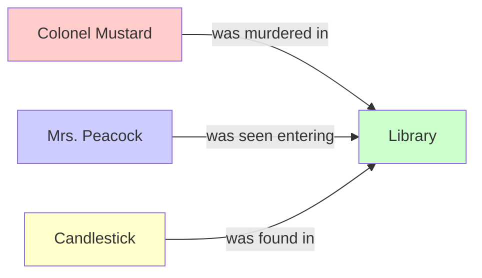
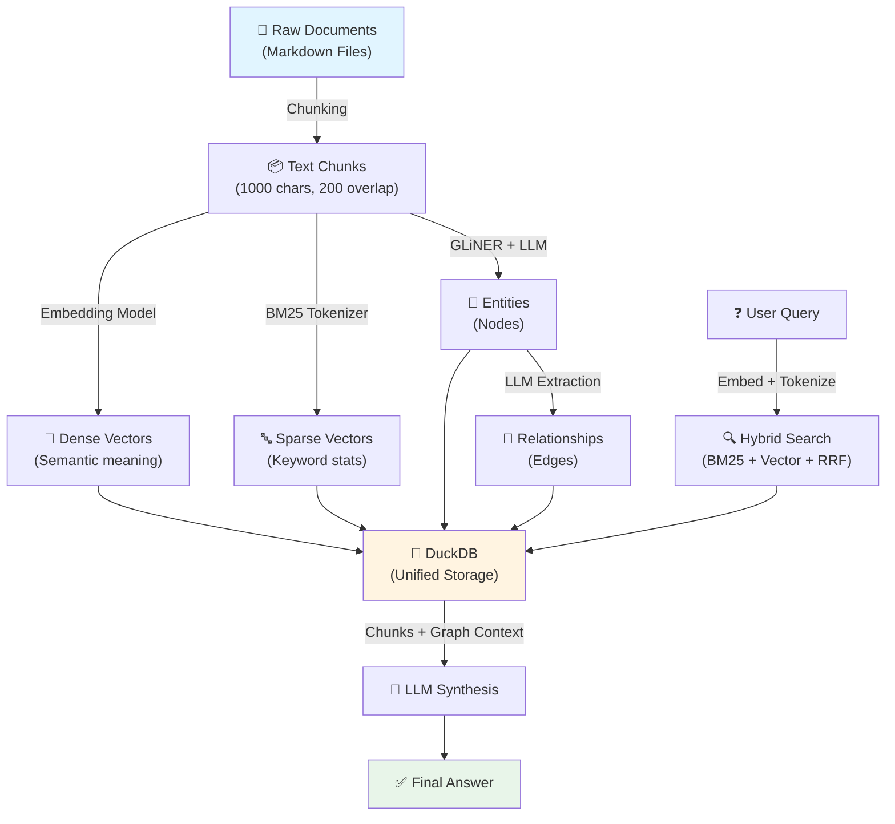

# What is GraphRAG?

**TL;DR**: GraphRAG gives your AI a "mind map" of your documents instead of just a pile of text chunks, making it drastically better at connecting ideas and answering complex questions.

---

## The Problem with Traditional RAG

Imagine you're reading a detective novel. Traditional RAG systems treat each page like a separate sticky note. When you ask "Who murdered Colonel Mustard?", the AI:

1. Searches for sticky notes mentioning "Colonel Mustard" and "murder"
2. Hands you the top 10 notes
3. Hopes the answer is somewhere in there

**The Issue**: If the clue is spread across different pages (e.g., "Mrs. Peacock was in the library" on page 12 and "the murder weapon was in the library" on page 45), the AI misses the connection.

---

##What GraphRAG Does Differently

GraphRAG builds a **knowledge graph** from your documents. Think of it as creating a mind map where:

- **Nodes** = Important entities (people, places, concepts)
- **Edges** = Relationships between them

### Visual Example



Now when you ask "Who murdered Colonel Mustard?", the AI can **traverse the graph**:

1. Start at "Colonel Mustard"
2. See he was murdered in the "Library"
3. Find who else was connected to the "Library"
4. Discover "Mrs. Peacock" and the "Candlestick" share that location
5. Synthesize: "Mrs. Peacock is a suspect because she was seen in the library where the candlestick (the murder weapon) was found."

---

## Traditional RAG vs GraphRAG

| Feature            | Traditional RAG                  | GraphRAG                                                               |
| :----------------- | :------------------------------- | :--------------------------------------------------------------------- |
| **Data Structure** | Flat text chunks                 | Interconnected graph                                                   |
| **Search Method**  | Keyword + Vector similarity      | Graph traversal + Hybrid search                                        |
| **Best For**       | Simple fact lookup               | Multi-hop reasoning, thematic analysis                                 |
| **Example Query**  | "What is the capital of France?" | "How did the 2008 financial crisis influence renewable energy policy?" |
| **Weakness**       | Misses connections across chunks | More complex to build and tune                                         |

---

## Real-World Use Case: Financial Analysis

### Your Data

You have 100 news articles mentioning "Nvidia", "AI chips", "Taiwan", "TSMC", "supply chain", etc.

### Traditional RAG Output

**Query**: "What geopolitical risks does Nvidia face?"  
**Answer** :(based on top 3 chunks)

- "Nvidia manufactures chips in Taiwan"
- "Taiwan has tensions with China"
- End of context → Generic answer

### GraphRAG Output

**Query**: "What geopolitical risks does Nvidia face?"  
**Graph Path**:

```
Nvidia → DEPENDS_ON → TSMC → LOCATED_IN → Taiwan → HAS_TENSIONS_WITH → China
Nvidia → COMPETES_WITH → Huawei → FUNDED_BY → Chinese Government
```

**Answer** (synthesized from graph):  
"Nvidia faces two primary geopolitical risks:

1. **Supply Chain**: Dependence on TSMC (Taiwan) exposes them to China-Taiwan tensions
2. **Market Access**: Competition from state-backed competitor Huawei could limit access to Chinese markets"

---

## Key Concepts in This System

### 1. **Chunks**

Your documents get split into ~1000-character segments (with overlap) to fit LLM context windows.

### 2. **Entities**

Significant "things" extracted from chunks:

- **Types**: PERSON, ORGANIZATION, LOCATION, CONCEPT, TECHNOLOGY, etc.
- **Example**: From "Elon Musk founded SpaceX in 2002"
  - Entity 1: "Elon Musk" (PERSON)
  - Entity 2: "SpaceX" (ORGANIZATION)

### 3. **Relationships**

Explicit connections between entities:

- **Example**: `Elon Musk --[FOUNDED]--> SpaceX`

### 4. **Hybrid Retrieval**

Combines two search strategies:

- **BM25**: Keyword matching (finds exact terms)
- **Vector Search**: Semantic similarity (finds meaning)
- **Fusion**: Merges results using Reciprocal Rank Fusion (RRF)

---

## How Data Flows Through the System



---

## Why This Project?

Unlike cloud-only solutions like Microsoft's GraphRAG or Neo4j-based systems, this implementation:

✅ **Runs 100% locally** (your data never leaves your machine)  
✅ **Uses a single DuckDB file** (no complex database setup)  
✅ **Supports both local models and cloud APIs** (flexible cost/quality trade-offs)  
✅ **Has auto-resume** (if indexing crashes, it picks up where it left off)  
✅ **Integrates with AI agents** via Model Context Protocol (MCP)

---

## Next Steps

- **[Intermediate]**: Jump to the [Architecture Overview](./system-overview.md) to see how components fit together.
- **[Deep Dive]**: Learn how the [Garbage Filtering](./garbage-filtering-explained.md) system keeps the graph clean.
